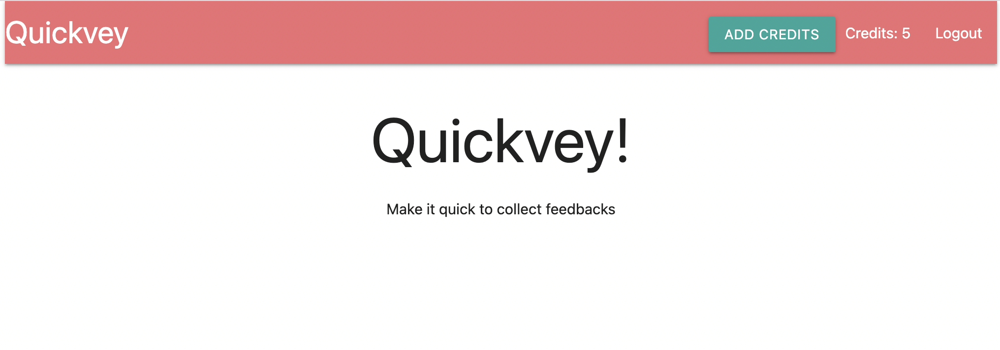
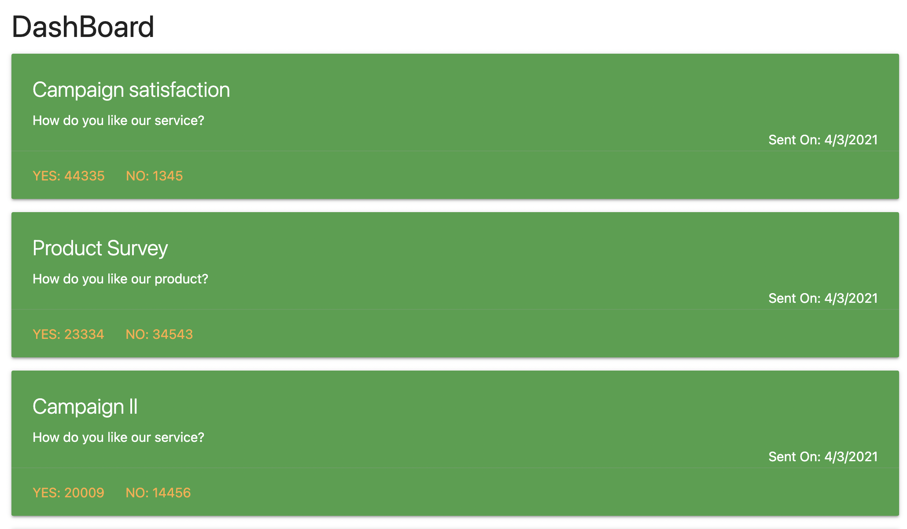

# FeedbackCollectingMERNproject

#### Stack applied: Javascript, Node.js, MongoDB, React, Redux 
#### Features: Google OAuth for user identification; credit-based payment supported by stripe; email survey sending by sendgrid 
#### Feature under building: A draft survey creation and saving function; More functions like sorting, searching on customized dashboard display  

This is an application for product managers or marketers to design surveys and collect feedbacks from customers. Users can create, review and update 
their surveys before they send them out to surveyees; the survey results can be presented in user friendly dashboard in real time so that users will 
get statistical insight immediately.

 

 
